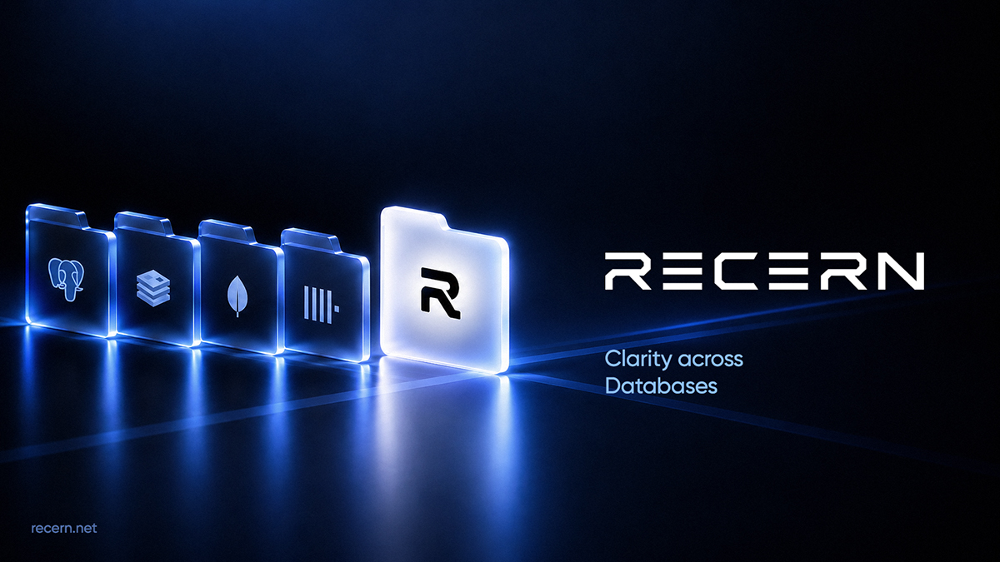

<p align="center">
  <a href="https://recern.net">
    
  </a>
</p>

<h2>
  <strong>Database Workspace</strong>
</h2>

<p>
  Analyze data, activity and performance across PostgreSQL, MongoDB, ClickHouse, Redis and more.
</p>

<p>
  <strong>Clarity across databases.</strong>
</p>

<p>
  Recern brings data, activity and performance into one workspace,<br/>
  with engine-specific views designed around how each database actually works.
</p>

<h3>
  Recern Vector
</h3>

<p>
  An open-source vector database in a single file: embedded, inspectable, no server to run.<br/>
  Rust, Python and a CLI. In our benchmarks it serves 1.3–1.8× the queries per second of faiss HNSW at equal recall.
</p>

```sh
pip install recern-vector
```

<p>
  <a href="https://github.com/recerndata/recern-vector">Repository</a>
  ·
  <a href="https://recern.net/vector">Project page</a>
  ·
  <a href="https://recern.net/vector/benchmarks">Benchmarks</a>
  ·
  MIT OR Apache-2.0
</p>

<p>
  <a href="https://recern.net">Website</a>
  ·
  <a href="https://www.linkedin.com/company/recern/">LinkedIn</a>
  ·
  <a href="https://x.com/recerndata">X</a>
</p>